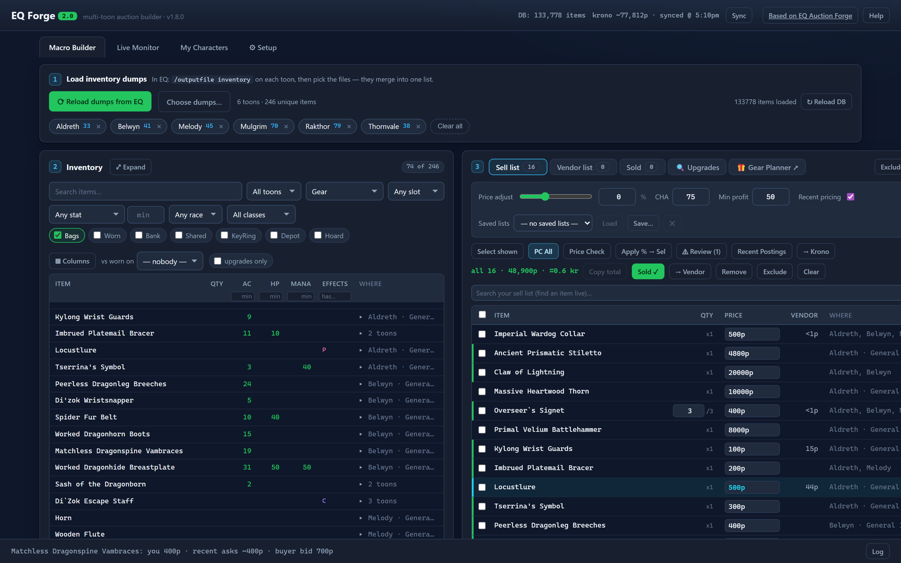
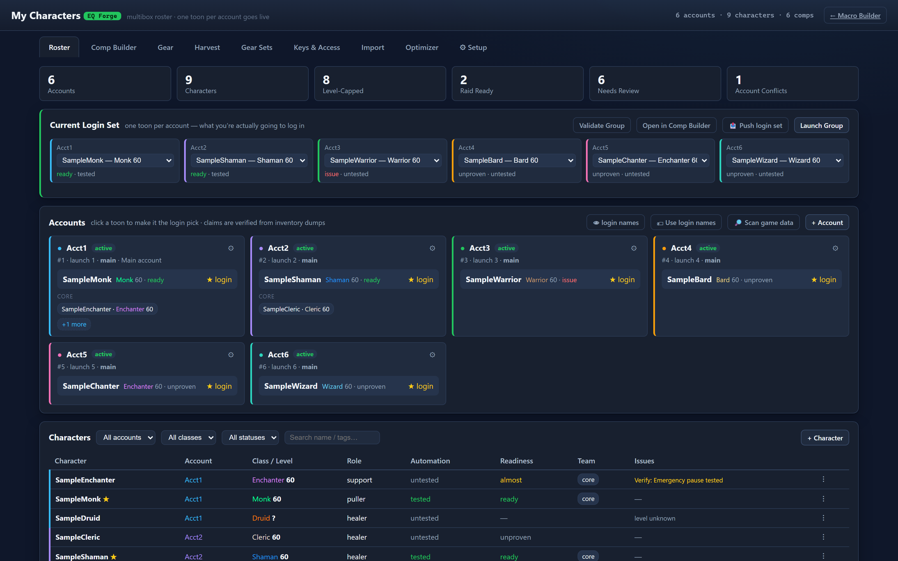
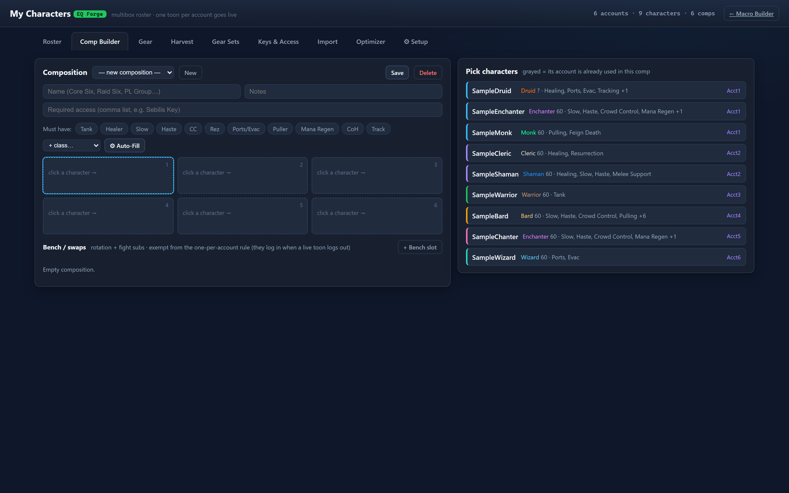
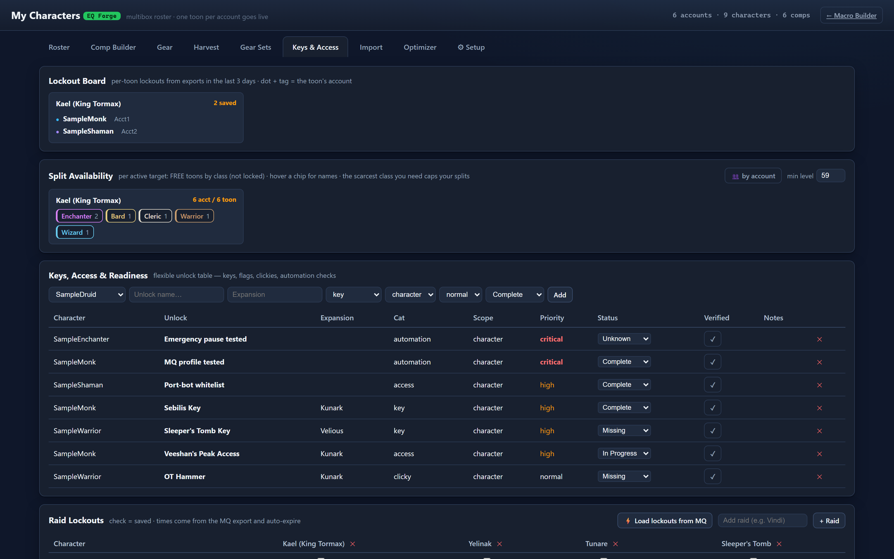
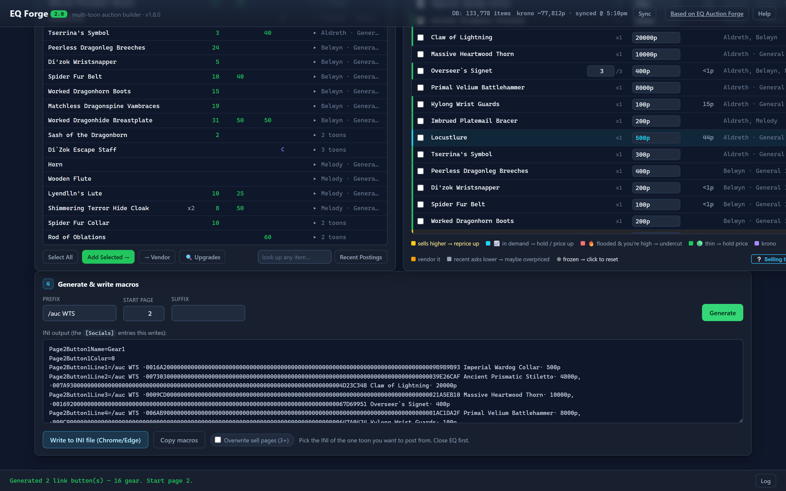
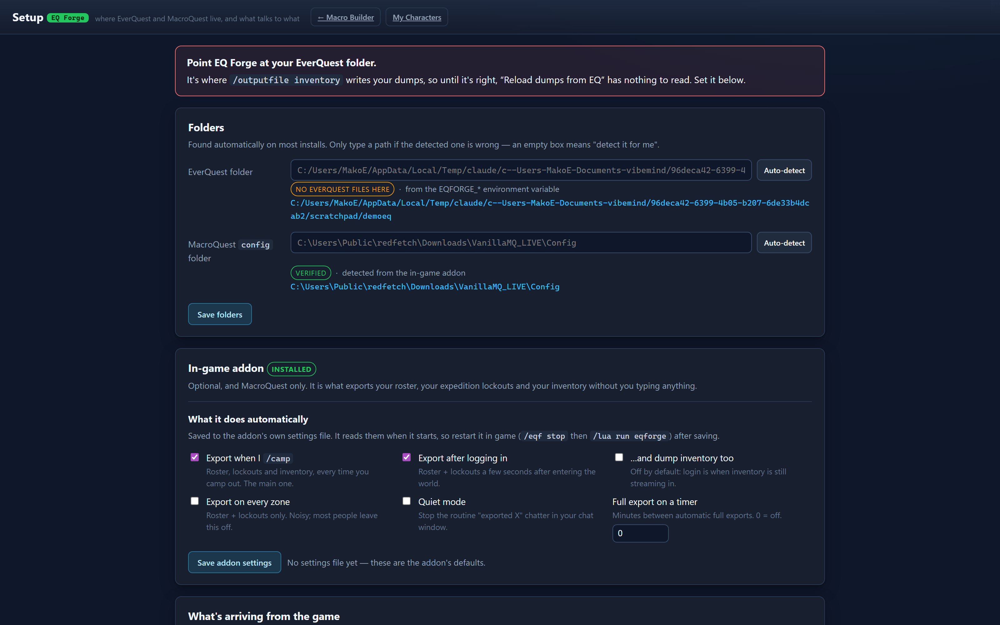

# EQ Forge 2.0

A browser tool for running an EverQuest box crew. Sell your loot across **all your toons at once** —
load every inventory dump, pull live TLP-Auctions prices, spot what's mispriced, build a WTS macro of
clickable item links and write it straight into a character's INI. Then the other half: a roster that
knows your accounts, your six-boxes, who's wearing what, and what's locked out.

Everything runs locally. Your inventory, INI, roster and logs never leave your machine — only item-id
price lookups go to TLP-Auctions.

A multi-toon fork of [EQ Auction Forge](https://github.com/wangel/EQ_Auction_Forge) by wangel —
see [CREDITS.md](CREDITS.md).

> **Start here:** [GETTING-STARTED.md](GETTING-STARTED.md) — what to download, how to run it, the full
> workflow, every tab, and how to read the price flags.
> **Running MacroQuest?** [MQ-SETUP.md](MQ-SETUP.md) — the optional in-game addon and gear delivery.

**Pricing needs Frostreaver**, the only server TLP-Auctions has data for. Everything else — inventory,
gear, roster, lockouts, macros — works on any server.

## Screenshots

**Macro Builder** — every toon's inventory merged into one list, priced against live
TLP-Auctions data, with market flags on each row.

**My Characters** — accounts, the current login set (one toon per account), and readiness
at a glance.

More — comp builder, lockout board, generated macros, setup

**Comp Builder** — six-boxes with one-character-per-account enforced, and role-gap warnings.

**Lockout Board** — per raid × account, who's free to field a run right now.

**Generated macros** — packed into `[Socials]` buttons of clickable item links.

**Setup** — finds your EverQuest and MacroQuest folders, and shows what's arriving from the game.

> Screenshots use placeholder character names and a sample roster. The item data and prices are real.

## What it does

**Selling**
- **Multi-toon inventory** — merge a `/outputfile inventory` dump from every toon into one list.
  Shared-bank items counted once, not per dump.
- **Filters** — Toon, Type, gear Slot, Class/Race, a stat filter (AC/HP/haste/resists…), and Location
  toggles (Bags / Worn / Bank / Shared / KeyRing / Depot / Hoard), plus live search.
  **Exclude forever** blacklists junk and storage bags for good.
- **Pricing** — TLP median check, signed price-adjust slider (undercut ⟷ markup, live), clean
  rounding, automatic krono for high-value items.
- **Market flags** — 🔥 *flooded* (price-aware: clears when you undercut to the pack) · 📈 *in demand*
  (WTB spam = hold) · 🟢 *thin* · gold *sells higher* (recent asks above your post — the full-history
  median lags badly on spells) · blue *overpriced*. **⚠ Review** filters to just the flagged ones.
- **Macros** — packs the list into `[Socials]` buttons of clickable item links, split Spell / Gear /
  Misc, and writes them into the INI of the one toon you post from.
- **Vendor list** and **Sold log** — a running "vendor these for ~X plat" tally, and sales tracking
  with today / all-time totals.
- **Live Monitor** — tails your EQ log for buyers who want something you're holding, one click to copy
  `/tell Buyer I have <item> for <your price>`.
- **🔍 Upgrades** — your equipped gear vs BIS and quest-armor data, slot by slot, with where to farm it.

**Roster** (My Characters)
- **Accounts + Comp Builder** — six-boxes with one-character-per-account enforced, and role-gap warnings.
- **Gear** and **Gear Sets** — worn stat sheets, plus snapshot a loadout, assign it to a toon, and get a
  move plan routed by real cost: own shared bank → same-account swap → trade → parcel.
- **Harvest** — dump coverage: who has one, how old, and who the last pass missed.
- **Lockout Board** — per raid × account, which accounts are free to field a run right now.

**Setup and MacroQuest**
- **⚙ Setup** — finds your EverQuest and MacroQuest folders automatically and shows what's arriving
  from the game, so an empty tab tells you *why* it's empty.
- **In-game addon** (optional, `extras/eqforge`) — `/camp` and your roster, lockouts and inventory
  export themselves. Nothing else in the app needs MacroQuest.

## Version history

**1.9.0** — **Comps drive gear sets.** A composition now records which loadout it fields for each
member, and one button makes that comp's sets the only active ones. A gear set is a *role loadout*,
not a character's property: the same "Rogue Main" goes on Gavriel in one comp and Zyrak in another,
and the comp you apply decides who wears it.

*Fixes, and one of them destroyed data:*
- **Saving a gear set could DELETE another set's picks.** If two active sets wanted more copies of an
  item than you own, the save silently ran `DELETE FROM gear_set_items` against the other set. If you
  have been using gear sets, check your older sets for slots that emptied themselves — and note that
  `tools/carve_deleted_gearset_rows.py` can often recover deleted rows from the database's free pages
  if you have not vacuumed. Contention is now *reported* and every set keeps its picks.
- **Picks with no slot were invisible but still claimed items.** Sets imported from the Macro Builder
  could carry picks with an empty slot; the editor draws one row per slot, so those never appeared
  while the planner went on reserving their gear. Slots are now inferred from the item on save, the
  editor shows any leftover as a "no slot" row you can remove, and
  `tools/fix_unslotted_gearset_rows.py` repairs an existing database.
- **Corpse dumps were loaded as characters.** `Vexrin's corpse0_frostreaver-Inventory.txt` parsed as a
  toon named "Vexrin's corpse0" and its items counted as gear you own. Ignored everywhere now.
- **A redundant Avatar slot no longer shops for a spare.** Naming the same weapon in both 2-Hander and
  Avatar told you to log in another character and mail a second copy over for nothing.
- Server filter on the inventory dumps — TLP prices are per-server, so two servers merged into one
  list value each other's gear.

*In-game (MacroQuest) — addon **1.4.0**, mailgear **1.2.0**. Copy `extras/` over your existing
install; a running client keeps the old Lua until the version changes:*
- **The Dragon's Hoard dump guard.** `/outputfile inventory` rewrites the whole file, and Hoard /
  Depot rows only export while that window is **open** — so every dump taken away from a banker
  silently replaced a full hoard record with nothing. The addon now reads those rows into memory
  first and splices them back: *replace*, never append (the app sums counts, so a duplicated row
  inflates what you appear to own), and *splice*, never whole-file restore (which threw away the
  refresh you asked for). It reports `kept N Hoard/Depot row(s) this dump would have wiped`.
- **Carried-forward hoard rows are dated honestly.** Spliced rows keep their original capture time in
  a `-Inventory.hoardasof` sidecar, so a fresh file mtime can't make month-old hoard data read as
  current. The harvest report shows the real age; no stamp reads as "unknown" rather than guessing.
- **mailgear equips gear the toon already has.** It read `moves` — only the pieces some *other*
  character hands over — so a piece already sitting in the target's own bags was skipped entirely
  and never got worn. It now reads `rows` (every piece the set calls for) and handles `have`
  (own bags), `grab` (own shared bank) and `worn`, where an already-correct piece reserves its slot
  so the equip step can't overwrite it. Older plan exports without `rows` still work unchanged.
- **mailgear trusts the exporter's location buckets** instead of matching strings itself. A Personal
  Tradeskill Depot location fell through to "other" and got queued for equipping from a place the
  script cannot reach.
- `/eqf` and the bank-run script honour the same hoard guard; a hoard-tagged character whose window
  never opened now refuses to dump rather than writing an empty record over a good one.

**1.8.0** — ⚙ Setup tab (auto-detects both folders; no more environment variables, no more features
silently returning nothing because a path was wrong) · **MacroQuest addon** that exports roster,
expedition lockouts and inventory automatically on `/camp` · fresh installs start with an empty roster
instead of a sample one · item database downloads itself when it isn't bundled.

**1.6.0** — macros split into Spell / Gear / Misc buttons, all clickable links · price-aware
*flooded* / *in demand* / *thin* market flags · "no sales" auto-fix by exact name · per-item pricing
slider and ❄ freeze · item clickouts to TLP-Auctions and AG/ZAM · gear stat filter · krono-aware
grand total.

## License

GNU **AGPL-3.0-or-later**, inherited from the EQAF fork — see [LICENSE](LICENSE) and
[CREDITS.md](CREDITS.md). Keep the source available if you deploy it.

The TLP-Auctions API is **PolyForm Noncommercial**: personal and community use only, never monetize it.
